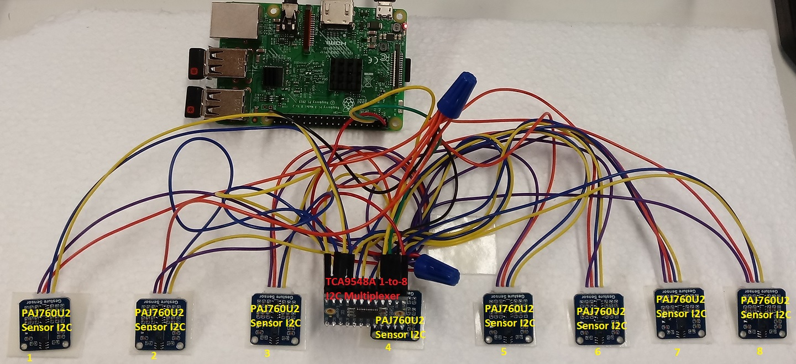
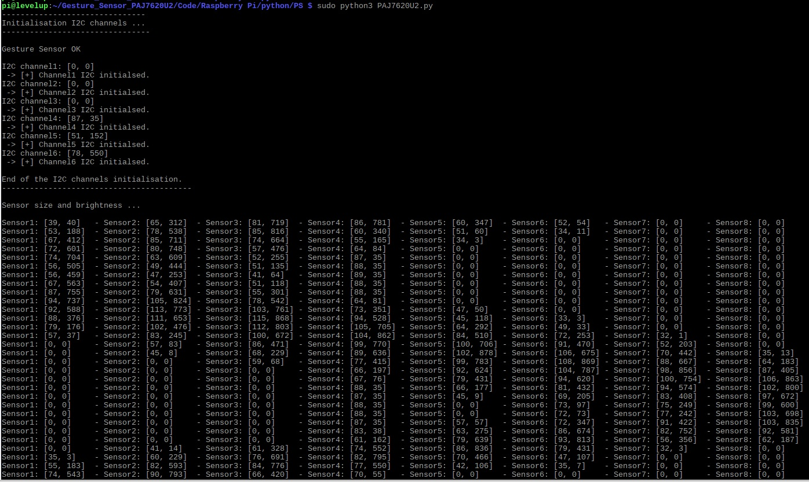

# 8 x Gesture Recognition Sensor I2C

In this project, we have wired eight gesture recognition I2C sensor with  the help of the TCA9548a 1-to-8 I2C multiplexer.

The Code simply switches from one channel to the other to request the sensors measurements, namely the size and brighness. 

## Photo of the Setup 

## Code output

Date: 30-09-2020 
Programmer: AK MT
DRINKOTEC

